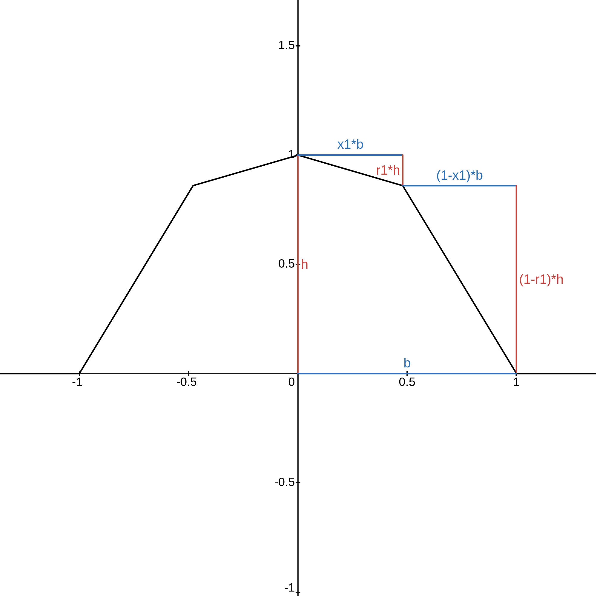

# String Art Generator

A String Art Generator written solely in C++. (Linux)

## Usage

```
https://github.com/anti-antinist/String_Art.git
cd String_Art/
bash run.sh target_name destination_name N intensity h b x1 r1 max_linesp max_liness default_val
```

The source folder contains a bash file namely `run.sh` which takes 11 inputs.

The inputs are as:

- Input/target image path `target_name` for the String Art Generator to approximate via threads.

- Output image path `destination_name`.

- No. `N` of nails.

- Intensity (Opaqueness) `intensity` of the drawn thread.

- Intensity `h` of the thread.

- Half-Width `b` of thread (in pixels);

- Percentage of initial slope width `x1`.

- Percentage of initial slope drop `r1`.

- Maximum Primary threads `max_linesp`.

- Maximum Secondary threads `max_liness`.

- Background colour `default_val`.

## Inputs' Details

-  **`target_name`**  The file that is going to be read by the program. It **MUST** be a square Binary PGM (P5) file.

- **`destination_name`** The file which will be used as output.

- **`N`** The number of nails.

- **`intensity`** The name says it. To further clarify the difference between `intensity` and `h`. The program will read the pixels from `target` as `pixel.value * h`, but the thread which will be drawn will have a darkness/whiteness `h * intensity * 255`.

- The following image can be used for tuning `x1,r1,h,b` . https://www.desmos.com/geometry/kx5avzuscm can be used as assistance. 



- **`max_linesp`** The maximum number of threads having the opposite colour as the background (drawn first).

- **`max_liness`** The maximum number of threads having the same colour as the background (drawn secondly).

## Customization

The ``Coordinate Generator::N2C(const unsigned int n, const unsigned int R)`` in `String_art.cpp` is written to arrange the nails in circular pattern. This can be changed to make new types of shapes/lattices. For example, to arrange nails in a regular grid,

```cpp
Coordinate Generator::N2C(const unsigned int n, const unsigned int R) {
	unsigned int max = std::sqrt(N);
	unsigned int x	 = ((float)n / max - std::floor(n / max)) * R * 2 * (1 + 1.0f / (max - 1));
	unsigned int y	 = std::floor(n / max) / max * R * 2 * (1 + 1.0f / (max - 1));
	return Coordinate(x, y);
}
```
## Further Assistance 

- Image Magick can be used to convert a different image format into square P5 images.

## Caution

- The code isnt particularly written for readability and stability in mind.
  
- If anyone would like to take the time and add a documentation, unit tests or even commments, I will happily cooperate in providing the information regarding the working of the program. 